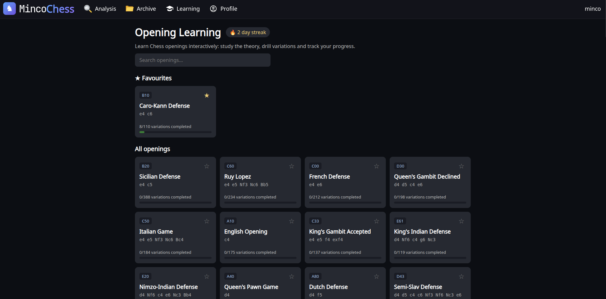
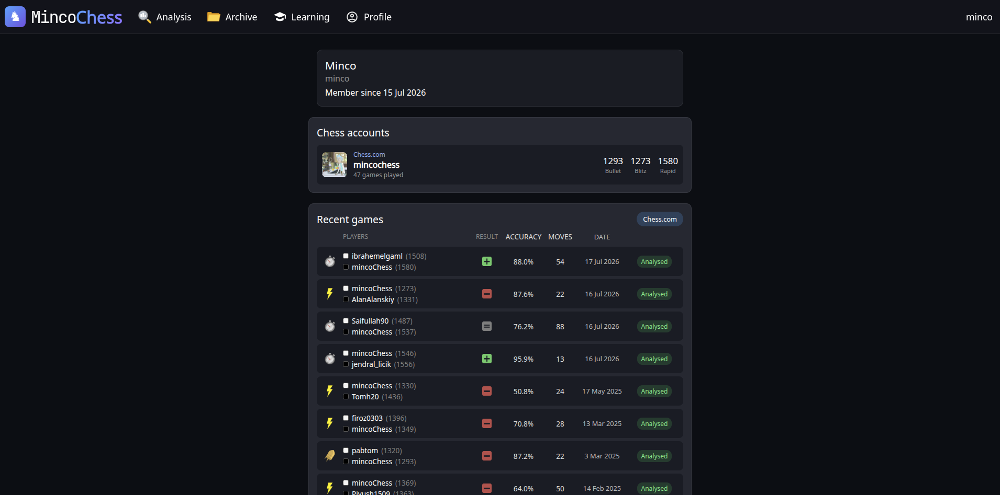
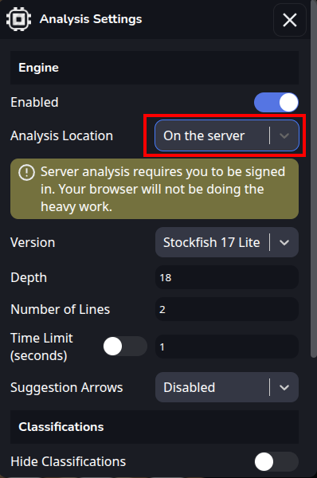
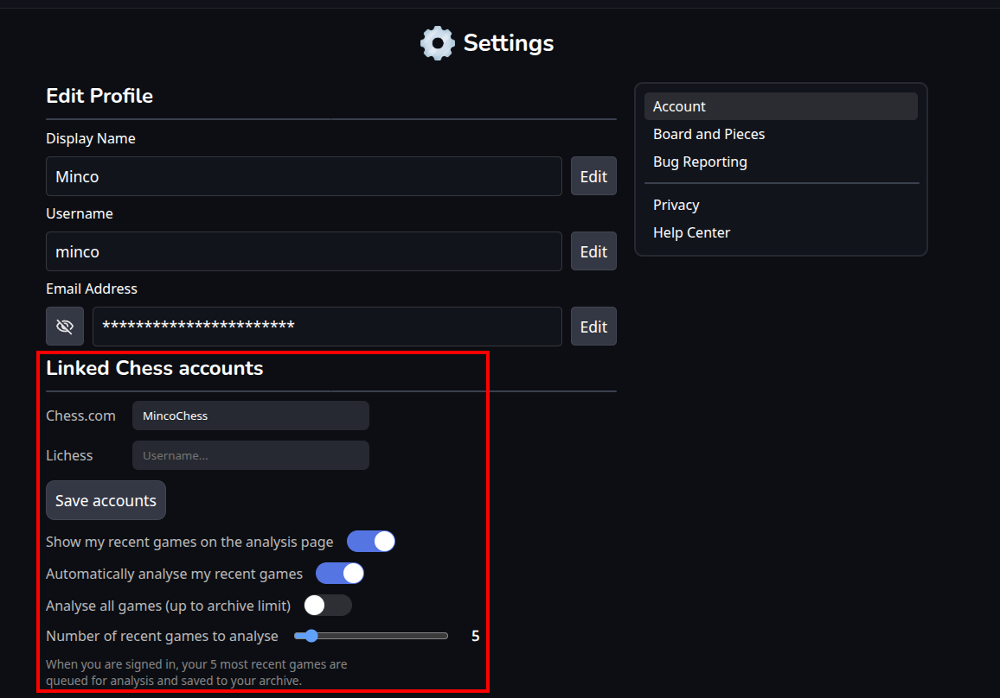

<h1 align="center">
    ♟️ MincoChess
</h1>

<p align="center">
    A website that analyses Chess games with move classifications, for free —
    with estimated Elo ratings, interactive opening lessons and server-side analysis.
</p>

> Based on [WintrChess](https://github.com/WintrCat/wintrchess) © wintrcat — free software under GNU GPL v3.0.

## ✨ Extra features on top of WintrChess

- **Estimated Elo** — a rating estimate for both players in every game report
- **Opening lessons** — theory deviation detection with an interactive practice mode
- **Learning tab** — opening catalog, lessons, challenges, streaks and progress tracking
- **Server-side analysis** — native Stockfish 17.1 running on the server (parallel engine pool)
- **Linked accounts & profile** — chess.com / lichess ratings, recent games and auto-analysis queue

## 📸 Screenshots

### 🎓 Learning tab
Browse the opening catalog, drill variations and keep up your daily streak:



### 👤 Profile — linked accounts & recent games
Link your chess.com / lichess account to see your ratings and recent games, analysed automatically:



### ⚙️ Server-side analysis & auto-analysis
Run Stockfish on the server instead of your browser, and let your latest games queue up for analysis by themselves:

<table>
    <tr>
        <td width="30%" valign="top">
            
        </td>
        <td width="70%" valign="top">
            
        </td>
    </tr>
</table>

## 📂 Project

The repository is a monorepo made up of three packages:

#### `client`
The frontend for the website built with React and TypeScript.

#### `server`
The backend for the website where the website content is served, and where any API endpoints will live.

#### `shared`
Libraries, some types and common logic is stored here and can be accessed by both other packages.

## 🚀 Running locally

```bash
cp .env.example .env   # fill in the values
npm install
docker compose up -d --build
```

The app runs on [localhost:8080](http://localhost:8080).

## 📚 Documentation

[Hosting locally](docs/hosting.md)

[Contributing to the upstream project](https://github.com/WintrCat/wintrchess/blob/master/docs/contributing.md)
